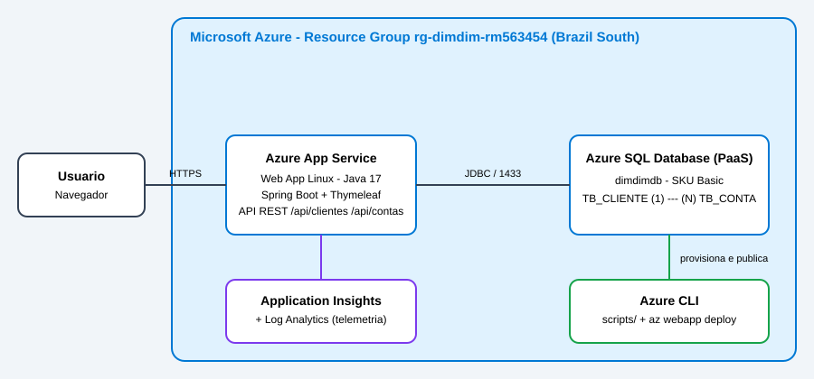

# DimDim - Web App bancario na nuvem Azure

Projeto do 2o Checkpoint (2o semestre) de DevOps Tools & Cloud Computing - FIAP.

## Descricao da solucao
Web App em Java 17 (Spring Boot) para gestao de clientes e contas bancarias do DimDim.
Possui telas (Thymeleaf) e API REST, com CRUD completo nas duas tabelas relacionadas
(`TB_CLIENTE` 1:N `TB_CONTA`). Os dados ficam no **Azure SQL Database (PaaS)**, a aplicacao
roda no **Azure App Service (Linux)** e o monitoramento e feito pelo **Application Insights**.
Toda a infraestrutura e criada por **Azure CLI** e o deploy usa `az webapp deploy`.

## Arquitetura


## Estrutura do repositorio
- `src/` codigo-fonte da aplicacao
- `scripts/` DDL das tabelas e scripts Azure CLI
- `json-tests/` JSON das operacoes GET, POST, PUT e DELETE
- `docs/` desenho da arquitetura

## API REST
| Metodo | Endpoint | Corpo |
|---|---|---|
| GET | /api/clientes e /api/clientes/{id} | - |
| POST | /api/clientes | json-tests/POST_criar_cliente.json |
| PUT | /api/clientes/{id} | json-tests/PUT_atualizar_cliente.json |
| DELETE | /api/clientes/{id} | - |
| GET | /api/contas e /api/contas/{id} | - |
| POST | /api/contas | json-tests/POST_criar_conta.json |
| PUT | /api/contas/{id} | json-tests/PUT_atualizar_conta.json |
| DELETE | /api/contas/{id} | - |

## How to - implantacao completa (Azure Cloud Shell, Bash)

### 1. Clonar o projeto
```bash
git clone https://github.com/DVKevin/dimdim-webapp.git
cd dimdim-webapp
```

### 2. Carregar as variaveis (a senha e digitada na sessao, nunca fica em arquivo)
```bash
source scripts/00_env.sh
```

### 3. Criar Resource Group e Azure SQL
```bash
bash scripts/10_infra_sql.sh
```

### 4. Criar as tabelas
No portal, abra o banco `dimdimdb` > Query editor, libere o seu IP, e execute o conteudo de
`scripts/01_ddl_dimdim.sql`.

### 5. Criar App Service, Application Insights e variaveis de ambiente
```bash
bash scripts/20_infra_webapp.sh
```

### 6. Compilar e fazer o deploy
```bash
bash scripts/30_deploy.sh
```

### 7. Testar o CRUD e conferir no banco
Use as telas (`/clientes` e `/contas`) ou a API com os JSON de `json-tests/`. Apos cada operacao,
confira no Query editor:
```sql
SELECT * FROM dbo.TB_CLIENTE;
SELECT * FROM dbo.TB_CONTA;
```

### 8. Monitoramento
No portal, abra o recurso Application Insights (`appi-dimdim-rm563454`): Live Metrics, Performance
e Application map. Para o banco, use Monitoring > Metrics no `dimdimdb`.

### 9. Limpeza
```bash
az group delete --name rg-dimdim-rm563454 --yes --no-wait
```

## Seguranca
Nenhuma senha, token ou connection string esta no codigo ou no repositorio. A conexao com o banco e
o Application Insights sao configurados por variaveis de ambiente do Web App.
